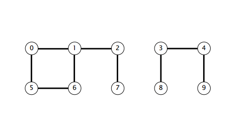
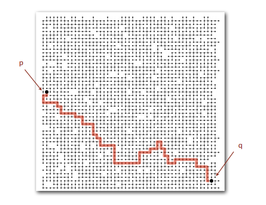
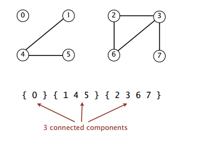
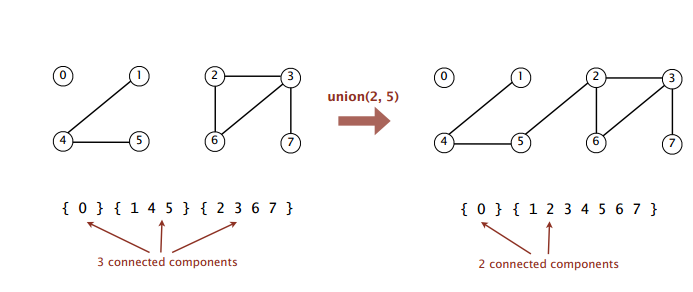

[Markdown 使用文档](http://commonmark.org/help "点击")

### Content
1) Given a set of N objects
2) Modeling the objects
3) Modeling the connections

**Given a set of N objects.**
- **Union command**: connect two objects.
- **Find/connected query**: is there a path connecting the two objects?

    union(4, 3) <br/>
    union(3, 8) <br/>
    union(6, 5) <br/>
    union(9, 4) <br/>
    union(2, 1) <br/>
    connected(0, 7)  <br/>
    connected(8, 9)  <br/>
    union(5, 0) <br/>
    union(7, 2) <br/>
    union(6, 1) <br/>
    union(1, 0) <br/>
    connected(0, 7)   <br/>

    

Q. Is there a path connecting _p_ and _q_ ? <br/>
 <br/>
A. Yes. <br/>

---

### **Modeling the objects**

##### Applications involve manipulating objects of all types.
- pixels in a digital photo.
- Computers in a network.
- Friends in a social network.
- [Transistors][a463a3fd] in a computer [chip][chip].
- Elements in a [mathematical][dd058d76] set.
- Variable names in Fotran program.
- [Metallic][ae137e36] sites in a composite system.

  [a463a3fd]: http://dict.youdao.com/w/eng/transistors "n. [电子] 晶体管；晶体三极管（transistor的复数）"
  [chip]: http://dict.youdao.com/w/chip/ "[电子] 芯片；筹码；碎片"
  [dd058d76]: http://dict.youdao.com/w/mathematics "n. 数学；数学运算"
  [ae137e36]: http://dict.youdao.com/w/eng/Metallic (adj. 金属的，含金属的)

##### When Programming, convenient to name objects 0 to N - 1.
- Use integers as array index.
- Suppress details not relevant to union-find. <br/>
( _can use symbol table to translate from site_ <br/>
_names to integers: stay tuned(Chapter 3)_ )

---

### **Modeling the connections** <br/>

##### We assume "is connected to" is an equivalence relation:
- Reflexive: _p_ is connected to _p_
- Symmetric: if _p_ is connected to _q_, then _q_ is connected to _p_.
- Transitive: if _p_ is connected to _q_ and _q_ is connected to r, then _p_ is connected to _r_.

##### Connected components. Maximal set of objects that are [mutually][3544610b] connected.

  [3544610b]: http://dict.youdao.com/w/eng/mutually "adv. 互相地；互助"



---

### Implementing the operations

##### **Find query**. Check if two objects are in the same component.

##### **Union command**. Replace components containing two objects with their union.



---
### Union-find data type (API)
Goal. Design efficient data structure for union-find.
* Number of objects _N_ can be huge.
* Number of operations _M_ can be huge.
* Find queries and union commands may be intermixed.

```
public class UF
______________________________________________________________
UF(int N)                   initialize union-find
                            data structure with N objects(0 to N - 1)

void union(int p, int q)    add connecion between p and q

int find(int p)             component identifier for p (0 to N - 1)

int count()                 number of components
```
---
##### Dynamic-connectivity client
* Read in number of objects _N_ from standard input.
* Repeat:
    - read in pair of integers from standard input
    - if they are not yet connected, connect them and print out pair

```
public static void main(String[] args) {
    int N = StdIn.readInt();
    UF uf = new UF(N);
    while (!StdIn.isEmpty()) {
        int p = StdIn.readInt();
        int q = StdIn.readInt();
        if (!uf.connected(p, q)) {
            stdOut.println(p + " " + q);
        }
    }
}
```
```
% more tinyUF.txt
10
4 3
3 8
6 5
9 4
2 1
8 9
5 0
7 2
6 1
1 0
6 7
```
